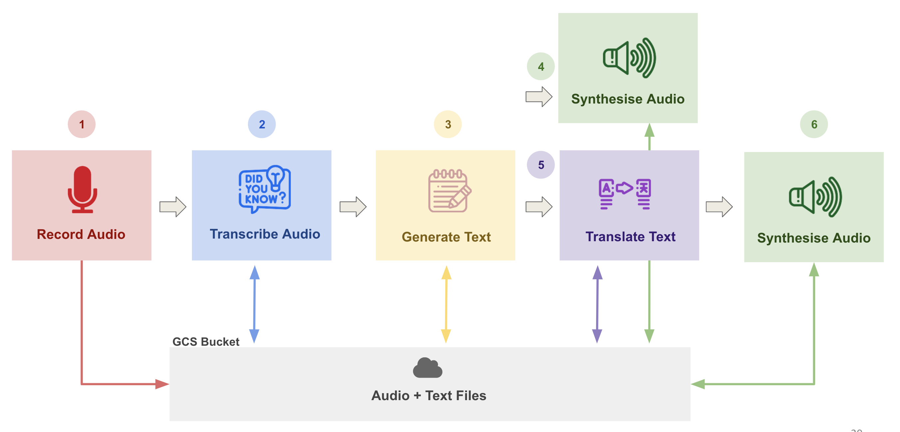
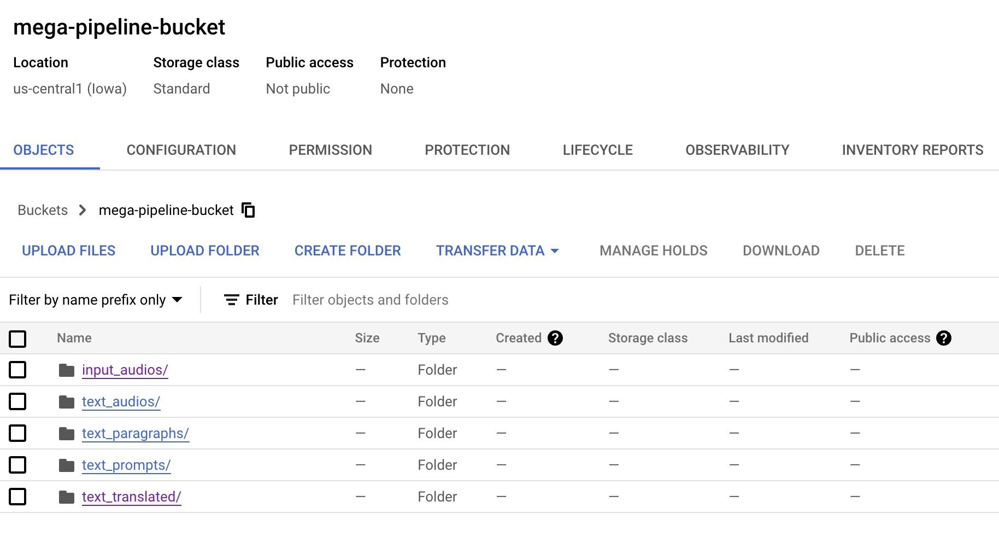

# Mega Pipeline App (Tutorial T5B)

🎙️ &rightarrow; 📝 &rightarrow; 🗒️ &rightarrow;  [🔊🇫🇷] &rightarrow; 🔊

In this tutorial we will build a [Mega Pipeline App](https://ac215-mega-pipeline.dlops.io/). Unlike what we did in T5, this time we will follow a more structured workflow.

*	The Dockerfiles and Pipfiles will be provided; you won’t need to create them.
*	You can either build the images yourself or run them directly from DockerHub.
*	Secrets should be stored in a folder outside the app directories, which will not be part of the repository.
*	A docker-shell.sh script is provided to handle all Docker-related tasks, including building, setting environments, and running containers.

 Remember the goal of this pipeline is the following:

* Pavlos has recorded audio prompts that will be used as our input data.
* The audio file is first transcribed using Google Cloud Speech to Text API
* The text is used as a prompt to an LLM to Generate Text (Full podcast)
* The generated text is synthesized to audio using Google Cloud Text-to-Speech API
* The generated text is also translated to French (or any other language) using Google
* The translated text is then synthesized to audio using Google Cloud Text-to-Speech API
* BONUS: Use the translated text and synthesize audio using ElevenLabs to output in Palvos' voice

The pipeline flow is as shown:


## The class will work in groups to perform the following tasks:
* 📝Task A [transcribe_audio](https://github.com/dlops-io/mega-pipeline/tree/flexible-workflow/transcribe_audio):
* 🗒️Task B [generate_text](https://github.com/dlops-io/mega-pipeline/tree/flexible-workflow/generate_text):
* 🔊Task C [synthesis_audio_en](https://github.com/dlops-io/mega-pipeline/tree/flexible-workflow/synthesis_audio_en):
* 🇮🇳Task D [translate_text](https://github.com/dlops-io/mega-pipeline/tree/flexible-workflow/translate_text):
* 🔊Task E [synthesis_audio](https://github.com/dlops-io/mega-pipeline/tree/flexible-workflow/synthesis_audio):

Same teams as in T5 will create a Docker containers to execute all the tasks. Each team will use a unique group-number to track the overall progress.
The overall progress of this mega pipeline can be viewed [here](https://ac215-mega-pipeline.dlops.io/).


## Create a local secrets folder and add the GCP Credentials File:

It is important to note that we do not want any secure information in Git. So we will manage these files outside of the git folders. At the same level as the app folders create a folder called secrets

Your folder structure should look like this:

|-mega-pipeline<br>
   &nbsp; &nbsp;   &nbsp; &nbsp;  |-transcribe_audio<br>
    &nbsp; &nbsp;   &nbsp; &nbsp; |-generate_text<br>
    &nbsp; &nbsp;   &nbsp; &nbsp; |-synthesis_audio_en<br>
    &nbsp; &nbsp;   &nbsp; &nbsp; |-translate_text<br>
    &nbsp; &nbsp;  &nbsp; &nbsp;  |-synthesis_audio<br>
|-secrets

Download the json file and place inside the secrets folder:
<a href="https://static.us.edusercontent.com/files/mlca0YEYdvkWPNEowJ0o4hOd" download>mega-pipeline.json</a>


## GCS Bucket Details:
* **input_audios** - Bucket where we store the input audio files
* **text_prompts** - Bucket where we store the text prompts that was synthesized by audio to text
* **text_paragraphs** - Bucket where we store the generated text from GPT2
* **text_translated** - Bucket where we store the translated text
* **text_audios** - Bucket where we store the audio of the paragraph of text
* **output_audios** - Bucket where we store the final French audio files
* **output_audios_pp** - Bucket where we store the French audio files (Pavlos voice)




### Resulting CLI options for each container

**Transcribe Audio**
```
python cli.py --download
python cli.py --transcribe
python cli.py --upload
```

**Generate Text**
```
python cli.py --download
python cli.py --generate
python cli.py --upload
```

**Synthesis Audio English**
```
python cli.py --download
python cli.py --synthesis
```

**Translate Text**
```
python cli.py --download
python cli.py --translate
python cli.py --upload
```

**Synthesis Audio**
```
python cli.py --download
python cli.py --synthesis
```


### Some notes for running on Windows
* Docker Win10 installation - needs WSL2 or Hyper-V enabled: https://docs.docker.com/desktop/windows/install/
* Use `Git` BASH to run (which is like a smaller `Cygwin`)
* Needed to add pwd in quotes in order to escape the spaces that common in windows directory structures
* Need to prefix docker run with `winpty` otherwise I get a "the input device is not a TTY." error
* `winpty docker run --rm -ti --mount type=bind,source="$(pwd)",target=/app generate_text`
