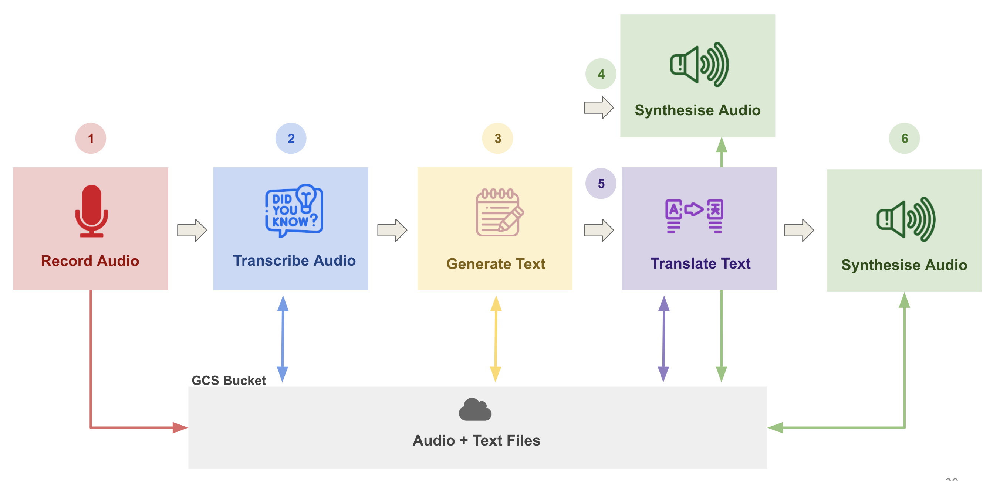
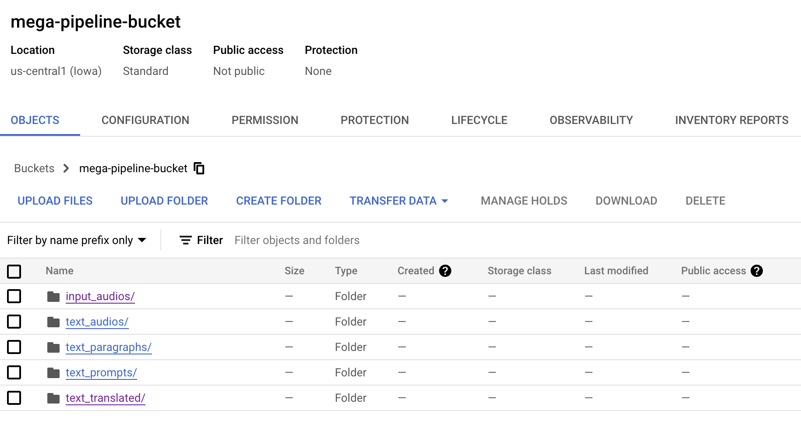

# Mega Pipeline App

🎙️ → 📝 → 🗒️ → [🔊🇫🇷] → 🔊  

The goal of this tutorial is to build an **AI-assisted podcast generator** that works across multiple languages. Starting from a recorded draft, we’ll transcribe it, enrich it with an LLM, translate it, and synthesize the result back into audio.

The key idea is to **simulate a microservice architecture**, where each component runs as its own containerized service. The full pipeline is shown below.

* Pavlos recorded a draft podcast in English, which serves as our starting point.  
* The audio file is transcribed using the Google Cloud Speech-to-Text API.  
* The resulting text is sent to an LLM to generate an expanded version of the podcast.  
* The generated text is synthesized into audio with Google Cloud Text-to-Speech.  
* The text is also translated into French (or another language) using Google Translation services.  
* The translated text is synthesized into audio again with Google Cloud Text-to-Speech.  
* **Bonus step**: The translated text can also be synthesized with ElevenLabs to recreate Pavlos’ voice.  

The pipeline flow is illustrated below:  


---

## Where We Are, Where We're Going

You've already built this pipeline once, with most of the scaffolding handed to you — a shared bucket, a shared service account, a ready-made Docker setup. That was enough to see the pieces fit together.

This branch is the **same pipeline, built the way a real team would build it**. Concretely, that means:

* 🪣 **Your own GCS bucket.** Each team provisions and owns its storage.
* 🔐 **Your own service account.** You create a Service Account in GCP, grant it the right IAM roles, download its JSON key, and manage it as a secret.
* 🐳 **Your own Dockerfile per component.** You write (or adapt) the Dockerfile that defines how each component runs.
* 🛠️ **A `docker-shell.sh` script per component.** The `docker build` and `docker run` commands now have to juggle multiple architectures, mounted volumes, environment variables, and secrets. Wrapping that logic in a script keeps the workflow sane and consistent across Mac/Linux/Windows.

### Two ways to work — and we support both
Once a Docker image exists for a component, a team can either **build it locally** or **pull a prebuilt copy** from a registry. There is no single "right" workflow:

* **Early in development** — devs pull the `Dockerfile` and `uv.lock` from GitHub and build images locally. Anyone can edit the Dockerfile or add dependencies and submit a PR.
* **Later in development** — a senior dev publishes prebuilt images to DockerHub. Most devs just pull and run; rebuilding is rare.

Each component's `docker-shell.sh` supports both modes: pass `dev` to build locally, `prod` to build multi-arch and push to a registry, `run` to pull and run from the registry, or no argument to build-and-run locally. That's the **flexible workflow** in the branch name.

> ℹ️ The `docker-shell.sh` files default to pushing under the `dlops` DockerHub org. If your team publishes its own images, update `DOCKER_USERNAME` inside each component's script.

---

## What You'll Learn
By completing this tutorial, you'll gain hands-on experience with:
- **Owning your own cloud resources** — bucket, service account, IAM roles.
- **Managing secrets safely** — keep them out of Git, mount them into containers at runtime.
- **Authoring Dockerfiles** for AI/ML workflows.
- **Encapsulating build/run logic in a script** so the workflow is repeatable across machines.
- **Working across two delivery modes** — build it yourself vs. pull a prebuilt image.

---

## The Five Components

Each component has its own folder, its own container, and its own README. Click through to follow along:

* 📝 [transcribe_audio](./transcribe_audio)
* 🗒️ [generate_text](./generate_text)
* 🔊 [synthesis_audio_en](./synthesis_audio_en)
* 🇫🇷 [translate_text](./translate_text)
* 🔊 [synthesis_audio](./synthesis_audio)

By the end, every team will have built a complete pipeline that mirrors a **real-world microservice architecture**: multiple independent services, each containerized, working together to form a larger application.

### Recommended folder layout

```
<your-workspace>/
├── mega-pipeline/          ← this repo
│   ├── transcribe_audio/
│   ├── generate_text/
│   ├── synthesis_audio_en/
│   ├── translate_text/
│   └── synthesis_audio/
└── secrets/                ← lives OUTSIDE the repo, mounted into containers at runtime
    └── mega-pipeline.json  ← your Service Account JSON key
```

The `docker-shell.sh` in each component mounts `../../secrets/` into the container at `/secrets`, so secrets stay one level above the repo and never get committed.

---

⚠️ **Set your group name**

Each `cli.py` writes its outputs to `…/<group_name>/…` inside your bucket. **Set the group name** at the top of each component's `cli.py` before you run it. The CLIs `assert` that the name has been changed from the default — if you forget, the script stops before doing anything.

---

## Connecting the Pipeline Components
In a production pipeline, containerized services talk to each other through APIs, sending requests and responses directly between microservices.

Since we haven’t covered APIs yet, we’ll simplify. Instead of calling one another directly, components will **communicate indirectly by writing their outputs to storage**, which the next stage will then read as input.

In this tutorial, rather than using your local disk, components will write to and read from **your team's own Google Cloud Storage (GCS) bucket**. The bucket acts like a common drive for transcripts, generated text, and synthesized audio — but each team owns its own, and each team's outputs are scoped under its `group_name` prefix.

This setup gives you practical hands-on experience now, while preparing you for the **API-driven systems** we'll tackle later.

---

### GCS Bucket Details
In Google Cloud, a **bucket** is an online folder where files can be stored and retrieved. Each team creates its own bucket inside the team's GCP project. The components read and write to it using the prefixes below:

* `input_audios/` — raw audio files (starting point).  
* `text_prompts/` — transcripts generated from speech-to-text.  
* `text_paragraphs/` — expanded text generated by the LLM.  
* `text_translated/` — translated versions of the text.  
* `text_audios/` — synthesized audio clips for each paragraph.  
* `output_audios/` — final audio outputs in French (or another language).  
* `output_audios_pp/` — French audio outputs in Pavlos’ voice.  




## Service Account & Secrets

Buckets won't let you read or write anything unless you are both **authenticated** (proving who you are) and **authorized** (having the right permissions). For server-to-server work like this, the standard pattern is a **Service Account** — an identity for your *code*, not for you.

In the earlier version of this tutorial we handed you a shared JSON key. In this branch **each team creates and owns its own Service Account**, following the steps covered in lecture:

1. In the GCP console, go to **IAM & Admin → Service accounts**.
2. Create a new service account (e.g. `mega-pipeline-sa`).
3. Grant it **Cloud Storage → Storage Admin** on your project (so it can read/write your bucket).
4. Under **Keys → Add Key → Create new key**, download a **JSON** key.
5. Save it as `mega-pipeline.json` in a `secrets/` folder that sits **one level above this repo** (see folder layout above).

The provided `docker-shell.sh` mounts that `secrets/` folder into the container at `/secrets` and sets `GOOGLE_APPLICATION_CREDENTIALS=/secrets/mega-pipeline.json`, so the calls to `google.cloud.storage` inside `cli.py` authenticate transparently.

🔑 **Never commit `secrets/` to Git.** Keeping the folder outside the repo (as this branch does) is the canonical way to make that mistake impossible.

---

## How to Run a Component

Every component is driven through its `docker-shell.sh`. From inside a component folder (e.g. `transcribe_audio/`):

```bash
./docker-shell.sh          # build the image locally and run it (default)
./docker-shell.sh dev      # only build the local image
./docker-shell.sh run      # run from a prebuilt image (falls back to DockerHub)
./docker-shell.sh prod     # build multi-arch (amd64 + arm64) and push to DockerHub
```

The default mode drops you into a shell **inside** the container with the `uv` virtual environment already activated and `/secrets` mounted. From there you run the CLI commands listed below.

If `docker-shell.sh` isn't executable yet:

```bash
chmod +x docker-shell.sh
```

> 🪟 **On Windows**, run from Git BASH and prefix with `winpty` if you see "the input device is not a TTY." (see notes at the bottom of this file).

---

## Running the Pipeline Components

Inside each component's container, drive it through `cli.py`. The flags (`--download`, `--transcribe`, `--generate`, `--translate`, `--synthesis`, `--upload`) follow the same pattern: pull inputs from your bucket, run the step, push outputs back.

**Transcribe Audio**
```bash
python cli.py --download
python cli.py --transcribe
python cli.py --upload
```
 
**Generate Text** 
```
python cli.py --download
python cli.py --generate
python cli.py --upload
```

**Synthesize Audio (English)**
```
python cli.py --download
python cli.py --synthesis
```

**Translate Text**
```
python cli.py --download
python cli.py --translate
python cli.py --upload
```

**Synthesize Audio (Translated)**
```
python cli.py --download
python cli.py --synthesis
```


### Sample Code: Read/Write to GCS Bucket

* Download from bucket
```
from google.cloud import storage

# Initiate Storage client
storage_client = storage.Client(project=gcp_project)

# Get reference to bucket
bucket = storage_client.bucket(bucket_name)

# Find all content in a bucket
blobs = bucket.list_blobs(prefix="input_audios/")
for blob in blobs:
    print(blob.name)
    if not blob.name.endswith("/"):
        blob.download_to_filename(blob.name)

```

* Upload to bucket
```
from google.cloud import storage

# Initiate Storage client
storage_client = storage.Client(project=gcp_project)

# Get reference to bucket
bucket = storage_client.bucket(bucket_name)

# Destination path in GCS 
destination_blob_name = "input_audios/test.mp3"
blob = bucket.blob(destination_blob_name)

blob.upload_from_filename("Path to test.mp3 on local computer")

```


### Sample Dockerfile
Each component ships with its own Dockerfile — see [`transcribe_audio/Dockerfile`](./transcribe_audio/Dockerfile) for the canonical example. The other components follow the same shape; the differences are just the extra OS packages they need (e.g. `ffmpeg` for audio).

### Some notes for running on Windows
* Docker Win10 installation - needs WSL2 or Hyper-V enabled: https://docs.docker.com/desktop/windows/install/
* Use `Git` BASH to run (which is like a smaller `Cygwin`)
* Needed to add pwd in quotes in order to escape the spaces that common in windows directory structures
* Need to prefix docker run with `winpty` otherwise I get a "the input device is not a TTY." error
* `winpty docker run --rm -ti --mount type=bind,source="$(pwd)",target=/app generate_text`
